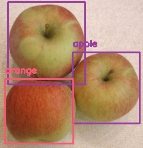

# Ungraded Lab - Deploying a Deep Learning model

[Course Repo](https://github.com/https-deeplearning-ai/machine-learning-engineering-for-production-public/tree/main/course1/week1-ungraded-lab)

## Introduction

In this lab, I successfully deployed a simple object detection model using YOLOv3, fastAPI, and uvicorn.



## Instructions

If you are using Macs with Apple Silicon like I do, install tensorflow using the following command:

```bash
conda create --name mlops python=3.8
conda activate mlops
python -m pip install tensorflow
```

Then, install the rest of the dependencies from requirements.txt (Note that the `fastapi` package should be in version 0.70.1):

```bash
pip install -r requirements.txt
```

Finally, run the following command to start the server:

```bash
jupyter notebook
```

Then, open the notebook `object_detection.ipynb` and run the cells.